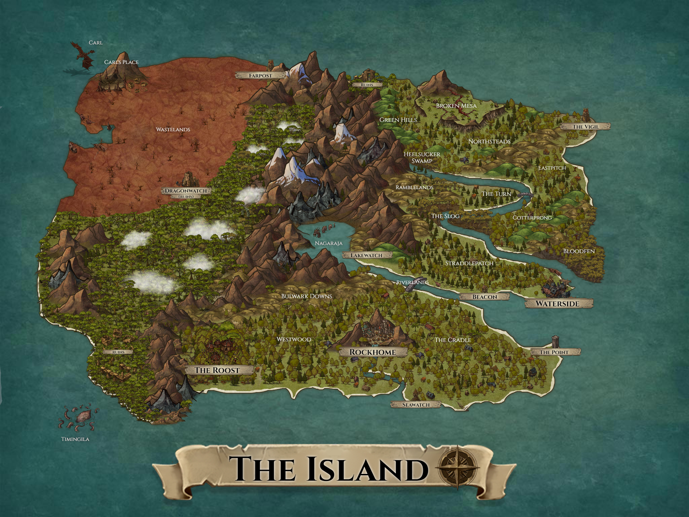

The Island
----------
The populace of the island has lived there for approximately 30 generations. Reasons are still in development. Over time the inhabitants have collqualified the names of most places. The islanders live in a constant fight for survival from the elements and the wild denizens of the island. Most settlements are temporary or seasonal in nature with only the three primary cities being permanent fixtures. There's also a series of outposts and watchtowers, some with speciliazed purposes as detailed in their respective entries.

Carl & Carl's Place
-------------------
Carl, the dragon, has a very real and impressive name that at least one part of sounds like 'Carl' and over time the islanders have just taken to referring to it by the shortened and familiar name. Every few generations some folks get clever and name their kids Carl or Carla, but it falls out of favor quicky.

Carl lives, it is believed, in a cave or series of caves in the mountain that has been designated Carl's Place. Many generations ago attempts were made to contact Carl that ended in disasterous results for the islanders. Carl is extremely territorial. After a period of hibernation Dragonwatch was constructed to alert the islanders of Carl's return. Never one to suffer encroachment on its territory, Carl destroyed the tower and all its inhabitants. Currently Farpost is the closest structure to Carl's domain that has been allowed to remain standing.

There is an apocryphal story of another dragon, black as a moonless night, that either flew to the island or emerged from the depths of the mountains. Carl seemd to immediately engage the interloper in ferocious combat. It is said that Carl slew the offending beast lightning fast and then consumed the corpse over the course of a few weeks.

Various Ruins
-------------
While the island is sprinkled with the remains of stoneworks, there are two major sites of ruins on the island. Expeditions to the ruin in the north come and go, but nothing of value has been found there in a few generations. No expeditions are mounted to the ruins to the west as they fall in Carl's domain and the few attempts at venturing there have met with disasterous results in the maw of Carl.

Dragonwatch
-----------
A stone tower that was constructed at the edge of Carl's domain to keep an eye out for the dragon's return. Carl laid waste to the structure with hellfire breath and killed all the inhabitants. 

Farpost
-------
The watchtower furthest from the islanders civilized lands. Most consider it a punishment to be sent here for duty. The primary function of this watch tower is to keep an eye on the activity of the dragon Carl and to watch the sea keeping with the 'ever vigilant' code of the island guard. 

Nagaraja
--------
In the center of the island is a lake inhabited by a monstrous serpent. Local lore refers to this beast as 'the king of serpents' or the Nagaraja. Nagaraja is content to rest idly in the lake, but will periodically jet down the river into the sea. Nagaraja is a reactionary beast and any craft, person, or creature unlukcy enough to be caught in its path is either eaten or destroyed. Islanders gave up trying to fish in the lake many generations ago as nothing seems to live there other than Nagaraja.

Lakewatch & Beacon
------------------
Lakewatch and Beacon are two signal towers that are manned by the island guard to alert islanders when Nagaraja begins to stir and leave his lair in the lake. 

The Vigil
---------
Situated on a lonely north east point, The Vigil is watchtower that keeps with the island guard code of 'ever vigilant'. The mission of those stationed there is to keep watch in case some new terror of the sea should arrive.

Waterside
---------
Also known as: Waterhome, The Sog, Wet Town, Port to Nowhere, Iselton

Waterside is believed to be the first permenant settlement on the island and lore casts it as the likely site of the crash that left the islanders stranded here. It serves as get away from the stuffiness of the stagnant woods and the rigor of the mountains. It's the closest thing to a tourist location on the island in addition to being the primary launch for the island guard's naval forces. 

Every couple of generations someone will fund another expedition off the island and it sets out from Waterside, but none have ever returned. Three to five days of sailing is all anyone has ever made it back from, and they all reported the same thing. In any direction there is only water.

Rockhome
--------
Also known as: The Rock, Rockytop, Stone City, The Triplets, Trip City, The Fort, Olvangard

Rockhome was established well after Waterside once the original islanders dared venture further out from the safety of Waterside. it is the largest and most densely populated settlement. Nestled on a plateau sandwiched between three mountains the city has grown over generations to take over the entirety of the plateau and even into the mountains. Up the sides and into the guts of the mountains. 

Rockhome has been the saving grace for the islanders on several catastrophic occasions, where Waterside and The Roost were abandoned until threats had past and the islanders could venture forth and reclaim their settlements.

The Roost
---------
The Roost is a collection of towers, forts, tree cities, and other construction that houses the forest dwellers of the islanders.

Seawatch
--------
Seawatch is a stone watchtower armed with a series of ballista that are used to repel and disuade Timingila from venturing too close to the shore. It also serves as a warning beacon for when Timingila decides to leave the depths on the southwest side of the island and hunt for stray ships to harass.

Timingila
---------
Timingila is a monstrous sea beast that occupies the depths off the southwest side of the island. Some believe there is a collection of these creatures, others believe there is only ever one of them at a time. No vessles travel near Timingila's domain and return.

The Point
---------
An all purpose signal and watch tower. 

Westwood, The Cradle, and Northsteads
-------------------------------------
These three regions are sparsely populated tracts that act as suburbs of sorts for the major cities. 